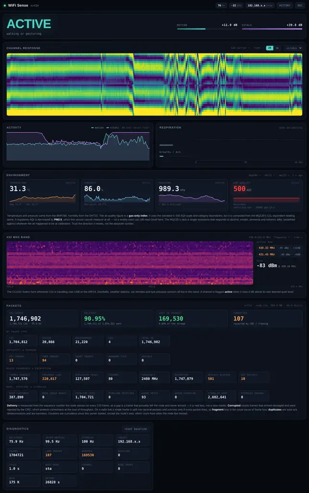
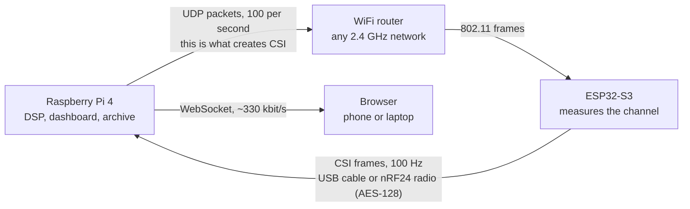
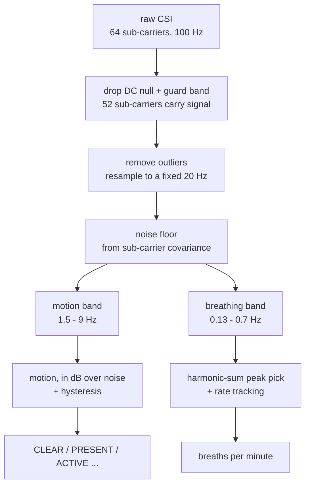
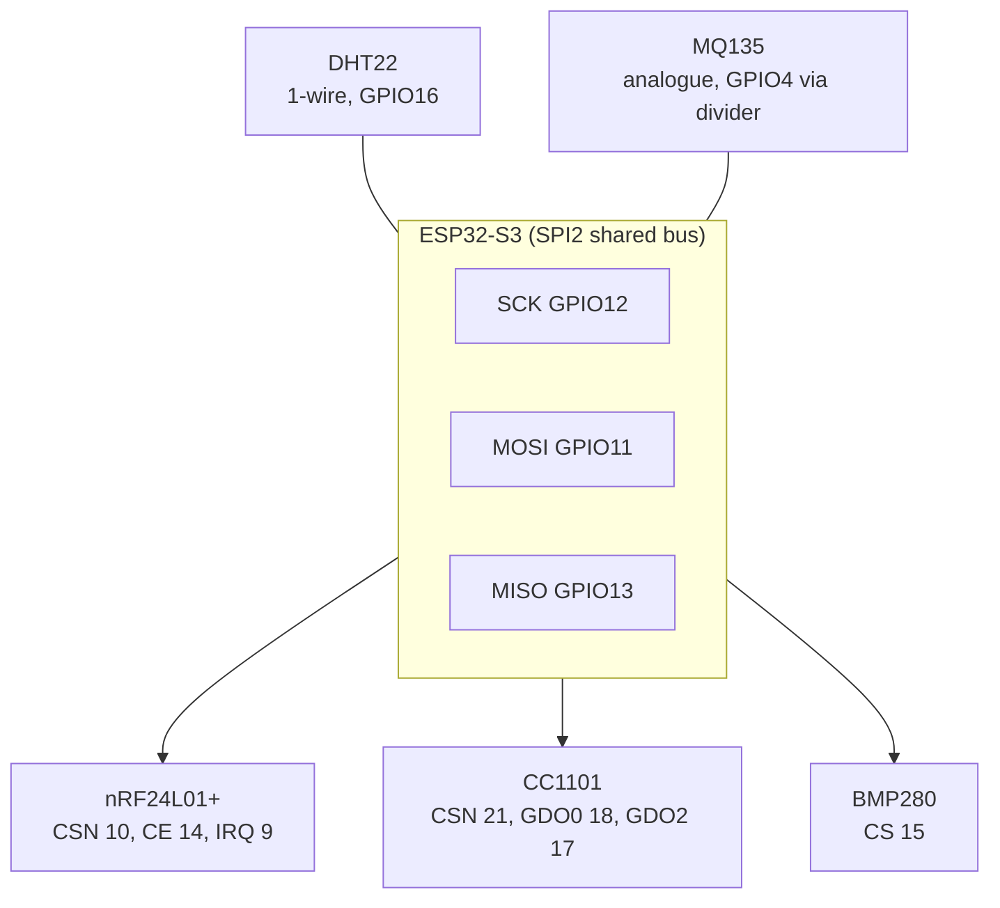

# WiFi Sense
*by The-Masked-Bear*

[](https://the-masked-bear.github.io/wifisense-pi)
[](https://debarghya47.gumroad.com/l/tzbkar)


[](https://github.com/The-Masked-Bear/wifisense-pi/actions/workflows/validate.yml)
[](https://github.com/The-Masked-Bear/wifisense-pi/actions/workflows/package.yml)
[](LICENSE)

**See motion, presence and breathing through walls, using nothing but ordinary
WiFi signals.**

An ESP32-S3 measures the WiFi radio channel 100 times a second. A Raspberry Pi 4
analyses it. A browser shows the result live. No camera, no PIR sensor, nothing
worn — and it detects a person sitting perfectly still by picking up their chest
moving as they breathe.



---

## Contents

1. [What it does](#1-what-it-does)
2. [What it cannot do](#2-what-it-cannot-do-and-why)
3. [How it works](#3-how-it-works)
4. [What you need to buy](#4-what-you-need-to-buy)
5. [Software you need](#5-software-you-need)
6. [Wiring](#6-wiring)
7. [Build it, step by step](#7-build-it-step-by-step)
8. [Running it](#8-running-it)
9. [Reading the dashboard](#9-reading-the-dashboard)
10. [Getting good results](#10-getting-good-results)
11. [Every command, in one place](#11-every-command-in-one-place)
12. [Troubleshooting](#12-troubleshooting)
13. [Prebuilt firmware and container images](#13-prebuilt-firmware-and-container-images)
14. [Repository layout](#14-repository-layout)

---

## 1. What it does

| | |
|---|---|
| **Motion** | walking, gesturing, sitting down. Reads ~28 dB above the noise floor — unmissable. |
| **Presence** | tells an empty room from a room with a *motionless* person in it. This is the hard one, and the thing PIR sensors get wrong constantly. |
| **Breathing rate** | 8–36 breaths/min, validated to within 0.1 bpm against known ground truth. |
| **Through walls** | 2.4 GHz passes through plasterboard, wood and glass. Brick and concrete attenuate heavily; foil-backed insulation blocks it. |
| **Activity class** | empty / still / subtle / active / vigorous. |
| **Environment** | temperature, humidity, pressure and a gas-based air quality index (optional sensors). |
| **Sleep report** | time in bed, still vs restless, disturbances, overnight breathing rate. |

## 2. What it cannot do, and why

This section matters more than the feature list, because most WiFi-sensing claims
online are describing a different instrument.

| claim you may have seen | reality here |
|---|---|
| See a person's outline or skeleton | **Impossible with WiFi.** 20 MHz of bandwidth gives a range resolution of `c / 2B = 7.5 m` — bigger than most rooms. The information is not in the signal. The famous MIT demos (RF-Pose, RF-Capture, WiTrack) use purpose-built FMCW radar with GHz of bandwidth and an antenna array, not WiFi. |
| Locate someone in the room | One transmitter and one receiver measure **one path**. You learn that something changed, not where. Needs 3+ separated nodes. |
| Count people | Two people disturb the channel more than one, but not in a reliably countable way. |
| Detect someone holding still **and** holding their breath | Nothing to measure. Physics, not a missing feature. |
| Identify *who* someone is | No. |
| Report sleep stages (REM / deep / light) | Those come from brain and eye activity, which is not in this signal at any level. This project reports **stillness**, which is what it measures, and leaves the interpretation to you. |

It is also not a medical device. It is a bedroom instrument built from a $5
microcontroller.

## 3. How it works

### The idea in one paragraph

A WiFi signal arrives at a receiver by many paths at once — straight there, plus
reflections off walls, furniture and people. Those copies add up with different
delays, so some frequencies reinforce and others cancel. That pattern across
frequency is called **Channel State Information (CSI)**, and most WiFi chips can
report it. Move anything in the room and the path lengths change, so the pattern
changes. A body is mostly water and reflects 2.4 GHz strongly, which is what
makes people visible. One wavelength at 2.4 GHz is 12.5 cm, so a chest moving
6 mm while breathing shifts a path by a measurable fraction of a wavelength.

### The data path



**You are sensing the space between the router and the ESP32.** Put them on
opposite sides of the room you care about, with the person in between.

### The surprise: you must generate traffic

CSI only exists when a packet is *received*. A silent channel produces no data at
all, no matter how good your hardware is.

| approach | measured CSI rate |
|---|---|
| Listen passively to ambient WiFi | ~1 Hz, irregular |
| ESP32 transmits, capture CSI from the ACKs | ~1 Hz (does not work) |
| **Pi sends UDP to the ESP32** | **1:1, up to 200 Hz** |

The third is what this project does, and it is why the node joins your WiFi
network. The sample rate is therefore *chosen*, not discovered — and evenly
spaced, which is what the breathing analysis needs.

### What the Pi does with it



Two details worth knowing, because they are the difference between this working
and not:

- **Both bands are Doppler frequencies, not body-movement rates.** A reflector
  moving at velocity `v` shifts the signal by `v / wavelength`, so walking at
  1 m/s writes energy near 8 Hz — not at walking pace. Breathing stays down at
  0.13–0.7 Hz, which is the only reason the two can be separated at all.
- **Everything is measured in dB above the receiver's own noise floor**, so an
  empty room reads 0 dB in any room, at any distance, at any transmit power.
  There is no calibration step and no learned baseline that can drift. The noise
  floor is found by decomposing the sub-carrier covariance: receiver noise is
  independent on every sub-carrier because it is generated inside the radio,
  while anything happening in the room moves all sub-carriers together.

## 4. What you need to buy

### Minimum build (motion, presence, breathing)

| # | part | notes |
|---|---|---|
| 1 | **ESP32-S3-WROOM-1, N16R8** | The sensor. Get this exact variant if you can; see the pin warning in [Wiring](#6-wiring). A dev board with a USB-UART bridge (CP2102) is easiest. |
| 1 | **Raspberry Pi 4** | 2 GB is plenty; uses ~20% of one core. Any Linux machine with USB works if you only use the cable. |
| 1 | **USB data cable** | Micro-USB or USB-C to match your board. **Charge-only cables are the single most common failure** — no serial device appears. |
| 1 | Any 2.4 GHz WiFi router | You almost certainly already have one. 5 GHz-only will not work: the ESP32-S3 cannot see 5 GHz. |

That is the whole shopping list. Total cost is roughly the price of the ESP32
board if you already own a Pi.

### Optional: wireless uplink (put the node anywhere)

| # | part | notes |
|---|---|---|
| 2 | **nRF24L01+ PA/LNA** | One for the Pi, one for the ESP32. **One module is half a link.** Needs decoupling capacitors — see [Power](#power-where-these-builds-usually-fail). |
| 2 | nRF24 breakout with AMS1117 regulator | Strongly recommended over bare modules; solves most power problems for you. |
| 2 | **CC1101 433 MHz** *(alternative)* | Out of band, so it cannot disturb the 2.4 GHz measurement. Software is complete; this build is blocked on antenna matching. Needs matching 433 MHz antennas. |

### Optional: environment sensing

| # | part | notes |
|---|---|---|
| 1 | **BMP280** (or BME280) | Pressure + temperature over SPI. Best thermometer of the three. |
| 1 | **DHT22 / AM2302** | Humidity + temperature. Get the **3-pin breakout**, which has the pull-up resistor already fitted. |
| 1 | **MQ135** gas sensor | Air quality. Analogue — read the divider warning in [Wiring](#environment-sensors-esp32-side). |
| 2 | 10 kΩ resistors | Voltage divider for the MQ135, if you power it from 5 V. |

Also useful: a breadboard, dupont jumpers, and a 5 V supply separate from the Pi
if you add the MQ135 (its heater draws ~150 mA continuously).

## 5. Software you need

| on the Pi | why |
|---|---|
| Raspberry Pi OS / any Debian-based Linux | Developed on Debian 13 (Trixie), Python 3.13 |
| `python3`, `python3-venv`, `python3-pip` | Debian blocks pip into system Python (PEP 668), so a virtualenv is required |
| `numpy`, `scipy` | the DSP. Install from apt and reuse them, or let pip fetch them |
| `git` | to clone this repo |
| A web browser | the dashboard has **no build step and no JavaScript dependencies** |
| PlatformIO *(only to build firmware yourself)* | `pip install platformio`. Skip it entirely by downloading a [prebuilt binary](#13-prebuilt-firmware-and-container-images) |
| SPI enabled *(only for radios)* | `sudo raspi-config` → Interface Options → SPI |

Install the OS packages:

```sh
sudo apt update
sudo apt install -y git python3-venv python3-pip python3-numpy python3-scipy
```

## 6. Wiring

### Simplest possible build: one cable

```
Raspberry Pi 4  ──── USB cable ────  ESP32-S3 dev board
```

That is genuinely it. The cable carries power and the CSI stream. Everything
below is only for the optional radios and sensors.

### Read this before wiring anything to the ESP32

The **N16R8** module pairs 16 MB of quad SPI flash with 8 MB of *octal* PSRAM,
and octal PSRAM consumes GPIO 33–37. Wiring a peripheral to a forbidden pin
produces a board that fails to boot with no useful error. This is the most common
way to brick this module.

| pins | what they are | verdict |
|---|---|---|
| GPIO 26–32 | internal SPI flash | **NEVER USE** |
| GPIO 33–37 | octal PSRAM (on N16R8) | **NEVER USE** |
| GPIO 0, 3, 45, 46 | boot strapping pins | avoid |
| GPIO 19, 20 | native USB D-/D+ | avoid |
| GPIO 43, 44 | UART0 console, in use | avoid |
| **1, 2, 4–18, 21, 38–42, 47, 48** | | **safe** |

### What goes on which bus



Three devices share one SPI bus and each gets its own chip select. The DHT22 is
a one-wire protocol of its own, and the MQ135 is analogue.

### ESP32-S3 pin summary

| GPIO | connects to |
|---|---|
| 4 | MQ135 `AO` — **through a divider**, see below |
| 9 | nRF24 `IRQ` |
| 10 | nRF24 `CSN` |
| 11 | SPI `MOSI` — shared: nRF24 + CC1101 + BMP280 |
| 12 | SPI `SCK` — shared |
| 13 | SPI `MISO` — shared |
| 14 | nRF24 `CE` (a mode pin, *not* a chip select) |
| 15 | BMP280 `CSB` / `CS` |
| 16 | DHT22 `DATA` |
| 17 | CC1101 `GDO2` |
| 18 | CC1101 `GDO0` |
| 21 | CC1101 `CSN` |

### Raspberry Pi 4 side (only if you add radios)

Shared SPI0 bus — wire to **both** modules:

| signal | BCM | physical pin |
|---|---|---|
| SCLK | 11 | 23 |
| MOSI | 10 | 19 |
| MISO | 9 | 21 |

nRF24L01+ → `/dev/spidev0.0`:

| module pin | BCM | physical | note |
|---|---|---|---|
| GND | — | 20 | |
| VCC | — | 17 | **3.3 V only. 5 V destroys it.** |
| CE | 25 | 22 | mode pin, not chip select |
| CSN | 8 | 24 | CE0 |
| IRQ | 24 | 18 | optional but worth wiring |

CC1101 → `/dev/spidev0.1`:

| module pin | BCM | physical |
|---|---|---|
| GND | — | 9 |
| VCC | — | 1 (**3.3 V only, nowhere 5 V tolerant**) |
| CSN / SS | 7 | 26 (CE1) |
| GDO0 | 23 | 16 |
| GDO2 | 27 | 13 |

> **CC1101 pin order varies by board.** At least three common breakout layouts
> exist and their pin *positions* differ. Match by the silkscreen label, never by
> counting pins.

### Environment sensors (ESP32 side)

**BMP280** (SPI — shares the bus, needs only its own chip select):

| module pin | ESP32-S3 |
|---|---|
| VCC | 3V3 |
| GND | GND |
| SCL / SCK | GPIO12 |
| SDA / SDI / MOSI | GPIO11 |
| SDO / MISO | GPIO13 |
| CSB / CS | GPIO15 |

> In SPI mode `SDA` is the **input** and `SDO` the **output** — the opposite of
> what the I2C-style names suggest. If the chip ID read fails, swap those two
> first.

**DHT22** — `VCC`→3V3, `DATA`→GPIO16, `GND`→GND. A bare 4-pin sensor needs a
10 kΩ pull-up from DATA to 3V3; 3-pin breakouts already have one.

**MQ135** — `VCC`→5V, `GND`→GND, `AO`→GPIO4 **via a divider**:

```
   MQ135 AO ────[ 10k ]────┬────[ 10k ]──── GND
                           │
                           └──────► ESP32 GPIO4   (2.5 V max)
```

The heater is specified for 5 V, and a 5 V-powered `AO` pin can output up to
5 V, which would destroy the ESP32's 3.3 V ADC input. Any matched pair of
resistors works — only the ratio matters.

**No-resistor alternative:** power the module from 3V3 and wire `AO` directly
(it can never exceed its own supply), then tell the node once:

```sh
python tools/node.py mq135 supply 3v3
```

> `GPIO4` is not arbitrary: it must be one of GPIO1–10, which are ADC1. ADC2
> (GPIO11–20) is physically unusable while WiFi is running — the radio owns that
> converter. Since WiFi is the entire point here, ADC2 is permanently off the
> table.

### Power — where these builds usually fail

- **nRF24L01+ PA/LNA is the problem child.** It draws ~115 mA spikes at +20 dBm
  and the Pi's 3.3 V rail cannot supply that transient. The symptom is
  distinctive: it works for a few packets, then goes silent for good. Solder
  10–100 µF electrolytic **plus** 100 nF ceramic directly across the module's own
  VCC/GND pins — at the module, not on a breadboard rail. Better: feed it from
  its own AMS1117-3.3 regulator off 5 V.
- **Attach antennas before powering up.** Transmitting into an open port can
  damage the power amplifier.
- **Match the CC1101 antenna to its band.** 433 and 868 MHz antennas are not
  interchangeable, and a mismatch looks exactly like a dead radio.
- **The MQ135 heater draws ~150 mA continuously.** If the ESP32 browns out or the
  CSI rate becomes erratic after adding it, give it its own 5 V supply with a
  common ground.

Full reasoning, plus the five nRF24 bugs that had to be fixed to get a reliable
link, is in [`PROJECT.txt`](PROJECT.txt) section 4.

## 7. Build it, step by step

### Step 1 — get the code

```sh
git clone https://github.com/The-Masked-Bear/wifisense-pi.git
cd wifisense-pi
```

### Step 2 — Python environment

`--system-site-packages` reuses the apt numpy and scipy, which saves a long
compile on a Pi.

```sh
python3 -m venv --system-site-packages .venv
./.venv/bin/pip install -r requirements.txt
```

### Step 3 — try it with no hardware at all

The synthetic link is a physics-based simulator, not a mock: it drives the real
detector chain, so the dashboard behaves exactly as it does on hardware. Do this
first — it proves your software install before any wiring can confuse you.

```sh
cd pi
../.venv/bin/python -m wifisense --link synthetic
```

Open **http://localhost:8080**. You should see the waterfall moving and the state
word changing. Stop with `Ctrl-C`.

### Step 4 — flash the ESP32

Either download a [prebuilt binary](#13-prebuilt-firmware-and-container-images),
or build it yourself:

```sh
pip install platformio
cd firmware
pio run -t upload --upload-port /dev/ttyUSB0
```

No serial port? `ls /dev/ttyUSB*` and `lsusb | grep -i "silicon labs"`. If
nothing appears, try a different USB cable first.

### Step 5 — tell the node which WiFi to join

2.4 GHz only. Credentials are stored in the ESP32's flash and survive power
cycles, so this is a one-time step with no recompile.

```sh
cd pi
../.venv/bin/python tools/node.py wifi "YourSSID" "YourPassword"
../.venv/bin/python tools/node.py info      # look for assoc=yes and an IP
```

> Opening the serial port resets the board, so it is unreachable for the first
> few seconds. `tools/node.py` waits for it; a raw terminal will not.

### Step 6 — run it for real

```sh
cd pi
cp config.example.json config.json          # optional; defaults work
../.venv/bin/python -m wifisense --link serial
```

### Step 7 — place the hardware properly

This matters more than anything else you will do:

```
   router  ────────────  person  ────────────  ESP32 node
              2 - 8 metres apart, node and router on
              OPPOSITE SIDES of the space you care about
```

Check the RSSI on the dashboard: **-40 to -60 dBm** is the useful range.

### Step 8 — start at boot

```sh
./install.sh              # server only
./install.sh --kiosk      # plus a full-screen browser on the Pi's display
./install.sh --uninstall  # remove
```

## 8. Running it

```sh
systemctl status wifisense       # is it running
journalctl -u wifisense -f       # live logs
sudo systemctl restart wifisense
```

| URL | what |
|---|---|
| `http://<pi-address>:8080` | live dashboard |
| `http://<pi-address>:8080/history` | recorded history + sleep report |

Run by hand instead (stop the service first):

```sh
cd pi
../.venv/bin/python -m wifisense --link serial      # USB cable
../.venv/bin/python -m wifisense --link synthetic   # no hardware
../.venv/bin/python -m wifisense --link nrf24       # 2.4 GHz radio
```

## 9. Reading the dashboard

| panel | what it tells you |
|---|---|
| **Big word** | CLEAR / PRESENT / MOVEMENT / ACTIVE / VIGOROUS. **PRESENT means someone is there but not moving** — detected by their breathing. |
| **MOTION (dB)** | gross movement. 0 dB is an empty room, above ~6 dB is real movement, walking reads 20–30 dB. |
| **VITALS (dB)** | breathing-band energy. This is what sees a still person. |
| **CHANNEL RESPONSE** | the waterfall. Horizontal bands are the room's standing multipath pattern; **vertical streaks are something moving.** |
| **ACTIVITY** | both dB readings over the last minute. Dotted lines mark the thresholds the system is actually deciding on. |
| **RESPIRATION** | breaths/min, the filtered waveform, and the spectrum with the chosen peak marked. Blank with a flat line is normal — it needs a still subject and ~30 s. |
| **ENVIRONMENT** | only appears once a sensor frame arrives, so a build with no sensors looks finished rather than broken. |
| **PACKETS** | every frame counter, grouped. Loss is measured from the node's own sequence numbers, so a gap is a frame that provably left the node and never arrived. |
| **DIAGNOSTICS** | sample rate should sit near 100 Hz; errors, dropped and rejected should stay at 0. |

Calibration takes about 6 seconds for motion and 30 seconds for breathing.

> **About the air quality number.** It uses the standard 0–500 AQI scale, the
> standard categories and the same piecewise-linear interpolation a real AQI
> uses — but it is computed from the MQ135's CO2-equivalent reading alone. A
> regulatory AQI is dominated by PM2.5, **which this sensor cannot measure at
> all**, so a smoky room can still read "Good". Trust the direction it moves, not
> the absolute number. Section 6d of `PROJECT.txt` explains this and the
> self-correcting baseline in full.

## 10. Getting good results

- **Node and router on opposite sides of the space.** You are sensing what
  happens between them, not around the node.
- **2 to 8 metres apart.**
- **A stronger signal is not better.** Very close together, the direct path
  dominates and your reflection is buried in it. Aim for RSSI -40 to -60 dBm.
- **Sit between the two**, ideally near the midpoint — not next to the node.
- **Breathing needs stillness.** Watch the MOTION reading, not your own sense of
  being still: typing and shifting in a chair both register. Respiration resolves
  below roughly +5 dB. While you move, the panel says "subject moving" and
  publishes nothing, which is correct.
- **A good lock looks like** motion under +5 dB, vitals above +20 dB, a rate that
  drifts by tenths rather than jumping, and confidence above 0.4.
- **Fans, curtains and pets register.** They are not false positives — something
  really is moving.

## 11. Every command, in one place

Run these from the `pi/` directory.

### Server

| command | what it does |
|---|---|
| `../.venv/bin/python -m wifisense --link serial` | run with the USB cable |
| `../.venv/bin/python -m wifisense --link synthetic` | run with no hardware |
| `../.venv/bin/python -m wifisense --link nrf24` | run over the 2.4 GHz radio |
| `../.venv/bin/python -m wifisense --link replay` | replay a recorded session |

### Talking to the node

| command | what it does |
|---|---|
| `tools/node.py info` | status: association, IP, CSI state, sample rate |
| `tools/node.py monitor 30` | measure the real CSI rate for 30 s |
| `tools/node.py wifi "SSID" "PASSWORD"` | provision WiFi (stored in flash) |
| `tools/node.py mode sta` / `mode sniffer` | associated mode vs promiscuous |
| `tools/node.py link usb` / `nrf24` / `cc1101` | switch transport (stored in flash) |
| `tools/node.py reboot` | restart the node |
| `tools/node.py radioscan` | probe the documented radio pins |
| `tools/node.py radiosweep` | hunt for radios on any usable GPIO (~20 s) |

### Environment sensors

| command | what it does |
|---|---|
| `tools/node.py env` | read all three sensors right now |
| `tools/node.py mq135 cal` | baseline the air quality (do it by an open window) |
| `tools/node.py mq135 supply 3v3` | tell the node `AO` is wired direct |
| `tools/node.py mq135 supply 5v` | tell the node `AO` goes via a divider |

### Checking correctness

| command | what it does |
|---|---|
| `tools/validate_dsp.py` | drive the whole detector chain with synthetic CSI of exactly known breathing rate — 81 checks. This is the only place the pipeline is falsifiable, and it is what CI runs on every push. |

### REST API

| endpoint | returns |
|---|---|
| `/api/state` | full live snapshot |
| `/api/health` | 200 when the link is delivering, 503 when not |
| `/api/history?hours=24&points=900` | archived series |
| `/api/sleep?night=YYYY-MM-DD` | one night's report (default: last night) |
| `/api/sleep/nights` | which nights hold data |
| `/api/history/stats` | rows held, span, write errors |

## 12. Troubleshooting

| symptom | cause and fix |
|---|---|
| No `/dev/ttyUSB*` | Charge-only USB cable, almost always. Then check `lsusb \| grep -i "silicon labs"`. |
| Sample rate ~1 Hz instead of ~100 Hz | The node is not associated, so the Pi's UDP stimulus cannot reach it. Run `tools/node.py info` and look for `assoc=yes`. Is the SSID 2.4 GHz? |
| Sample rate 0 | Check `csi=ok` in `tools/node.py info`. `FAILED` means the CSI API was rejected — usually a firmware/IDF mismatch. Reflash. |
| Everything reads CLEAR with someone in the room | They are not between the node and the router. Check RSSI is -40 to -60 dBm. |
| Everything reads ACTIVE in an empty room | Something *is* moving: fan, open window, pet. Also check the node is physically stable — a board swinging on its cable is motion. |
| Breathing never resolves | Needs a still subject, 30+ seconds, and a rate above ~20 Hz. "subject moving" is the motion detector vetoing it, which is correct. |
| Link errors climbing | Serial corruption. Shorter or better USB cable. The CRC catches every corrupted frame, so this costs rate, not correctness. |
| Environment panel never appears | No environment frame has arrived. Ask the node directly: `tools/node.py env`. |
| BMP280 = ABSENT | `SDO`/`SDA` swapped (most likely), `CSB` not on GPIO15, or an I2C-only breakout with `CSB` tied high on the PCB. |
| DHT22 = NO-REPLY | Missing 10 kΩ pull-up on a bare 4-pin sensor; `DATA` not on GPIO16. |
| MQ135 = OUT-OF-RANGE | Near 0 mV: `AO` not connected. Near supply: element saturated, **or `AO` wired straight to 5 V with no divider — check this first, it can damage the ADC.** |
| Air quality stuck at "WARMING UP" | Auto-calibration needs 3 minutes of power *and* a valid reading. |
| Service will not start | `journalctl -u wifisense -n 40` |

Longer explanations for every one of these are in
[`PROJECT.txt`](PROJECT.txt) section 9.

## 13. Prebuilt firmware and container images

### Flash without installing PlatformIO

Every tagged release attaches ready-to-flash binaries — see
[**Releases**](https://github.com/The-Masked-Bear/wifisense-pi/releases). The merged
factory image flashes at offset `0x0`:

```sh
pip install esptool
esptool.py --chip esp32s3 --port /dev/ttyUSB0 --baud 921600 \
    write_flash 0x0 wifisense-firmware-v1.0.0.bin
```

Verify what you downloaded first:

```sh
sha256sum -c SHA256SUMS
```

> **The published binary contains an all-zero placeholder radio key.** That is
> fine for the USB cable, which is not encrypted anyway. If you use a radio link,
> set your own key and rebuild — a prebuilt binary cannot carry a private key.
> See [Radio link security](#radio-link-security).

### Run the server in a container

Images are published to GitHub Container Registry for `linux/amd64` and
`linux/arm64`:

```sh
# dashboard with no hardware, at http://localhost:8080
docker run --rm -p 8080:8080 ghcr.io/the-masked-bear/wifisense-pi:latest

# with a real node on the USB cable
docker run --rm -p 8080:8080 --device /dev/ttyUSB0 \
    ghcr.io/the-masked-bear/wifisense-pi:latest python -m wifisense --link serial
```

### Radio link security

CSI reveals when a room is occupied, when people move and when they sleep. In the
clear, anyone in range with a matching radio on the same channel reads all of it.
So everything sent over a radio link is encrypted with **AES-128 in counter
mode**, with a fresh random session ID per boot and replay rejection.

Generate a key and put the same value in both ends:

```sh
python3 -c "import secrets;print(secrets.token_hex(16))"
```

| where | as |
|---|---|
| `firmware/src/config.h` → `RADIO_KEY` (or a gitignored `firmware/src/secrets.h`) | `{0x.., 0x.., ...}` |
| `pi/config.json` → `radio_key` | 32 hex characters |

A mismatch shows up as `cobs_errors` climbing with `frames_ok` stuck at zero.
This is confidentiality, not authentication: the CRC-16 inside the encrypted
payload means a random forgery survives with probability 1/65536, which is
proportionate for a home sensor but is not a MAC.

## 14. Repository layout

```
PROJECT.txt              the real documentation: everything, in one file
requirements.txt         Python dependencies
Dockerfile               container image for the Pi-side server
install.sh               autostart installer
systemd/                 service template

firmware/                ESP32-S3 firmware (PlatformIO)
  platformio.ini         board config. qio_opi is required for the N16R8
  src/config.h           tunables: mode, pins, rates, sensor toggles
  src/main.cpp           CSI capture, framing, command handling
  src/radio_tx.*         nRF24 + CC1101 uplink, SPI bus arbitration
  src/cc1101_driver.*    in-tree CC1101 register driver
  src/bmp280.*           in-tree BMP280/BME280 SPI driver
  src/sensors.*          DHT22, MQ135, and the sensor sampling task
  src/link_crypto.*      AES-128-CTR for the radio link

pi/
  wifisense/
    protocol.py          wire format: COBS framing, CRC-16, sub-carrier map
    stimulus.py          the UDP generator that sets the sample rate
    archive.py           SQLite long-term store + the sleep report
    spectrum.py          CC1101 sub-GHz band monitor
    dsp/                 csi -> filters -> motion / breathing -> pipeline
    link/                serial, nrf24, cc1101, replay, synthetic
    api/server.py        FastAPI, WebSocket, REST
  web/                   dashboard + history page. No build step, no dependencies
  tools/node.py          command-line control of the ESP32
  tools/validate_dsp.py  correctness tests against known ground truth
```

## Documentation

[**`PROJECT.txt`**](PROJECT.txt) is the canonical document, written to be read at
the bench away from the terminal: complete wiring, setup, tuning, troubleshooting,
and the reasoning behind every constant. It also records the bugs that had to be
fixed and what each looked like — including the one where a real subject's
*seventh* harmonic measured 2.4 dB above the fundamental and the peak picker duly
reported a breathing rate seven times too fast.

## Measured performance

| | |
|---|---|
| CSI sample rate | 100 Hz, 1:1 with the stimulus (200 Hz also works) |
| Wire rate | 149 bytes/frame, 119 kbit/s (~16% of the serial link) |
| Pi CPU | ~20% of one core |
| Empty room | +1.1 dB motion, +0.0 dB vitals |
| Walking | +27.8 dB motion |
| Still person breathing | +33.6 dB vitals |
| Breathing accuracy | 14.1 bpm measured against 14.0 truth; 22.0 against 22.0 |
| Encrypted nRF24 link | 108.1 Hz delivered of 113.6 Hz captured (95.1% end to end) |
| Serial link errors | 0 CRC, 0 framing, over sustained runs |
| DSP validation | 81/81 checks pass |

## License


## Support this project

If you found this project helpful and want to support its development, consider dropping a tip! It helps keep the open-source work going.

<a href="https://debarghya47.gumroad.com/l/tzbkar" target="_blank">
  
</a>
[Apache-2.0](LICENSE). Copyright 2026 The-Masked-Bear

